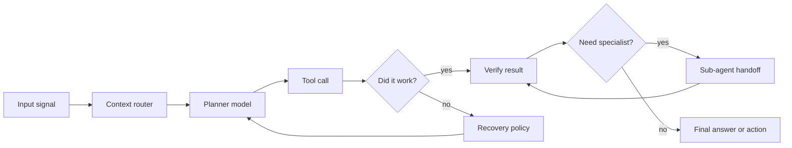

<div align="center">

<br/>

<table>
<tr>
<td align="center" width="900">

<samp>edge-runtime.ready / agent-harness.online / cloud.optional</samp>

<h1>Anshul Panigrahi</h1>

<samp><b>AI/ML Engineer</b> // Edge AI // Agentic Systems</samp>

<br/><br/>


</td>
</tr>
</table>

<br/>

[](mailto:anshulpanigrahi3678@gmail.com)
[](https://linkedin.com/in/anshul-panigrahi22)
[](https://github.com/burntcookiedough)
[](https://vit.ac.in)

<br/><br/>


</div>

---


```yaml
name:     Anshul Panigrahi
role:     AI/ML Engineering Intern (actively looking)
location: VIT Vellore, Tamil Nadu, India
patents:  2   # yes. as a third-year. I am also surprised.

obsessions:
  - On-device LLM inference without the cloud knowing about it
  - Agentic pipelines that recover when things go wrong
  - Multi-agent orchestration on N8N and beyond
  - Making tiny hardware do very unreasonable things
  - Reading every new agent framework paper at 1am and calling it research

current_build: "Multi-agent workflow — Hermes Agent + custom tool harness"

fun_fact: >
  My health app flagged my sleep as anomalous for 31 consecutive days.
  The model was correct every single time.
```


---

## The Work

<table>
<tr>
<td width="50%" valign="top">

**Real-Time Predictive Maintenance**
*Patent Application Filed — Feb. 2026*

Full Lambda architecture. Kafka ingests, Spark processes, Cassandra stores, PyTorch infers — across 5,000 simulated factory machines simultaneously. Graph analytics on the machine connectivity network detects cascade failures before the first machine goes down.

`98% accuracy` `F1: 0.96` `AUC: 0.99` `<12ms latency`

[View Repository](https://github.com/burntcookiedough/Real-Time-Predictive-Maintenance)

</td>
<td width="50%" valign="top">

**Physical-Bounded Multimodal Mode Discovery**

Unsupervised fault detection on NASA CMAPSS and CWRU benchmarks. No labels. No supervision. HDBSCAN finds the clusters; physics constraints filter anything that violates thermodynamics or vibration limits. Found 7 fault regimes on CMAPSS and 8 on CWRU.

`80% physics constraint pass rate` `Zero labeled training data`

[View Repository](https://github.com/burntcookiedough/Physical-Bounded-Multimodal-Mode-Discovery)

</td>
</tr>
<tr>
<td width="50%" valign="top">

**Stella**

On-device AI health assistant. Mistral 7B runs locally via Ollama, reads your wearable data, answers your health questions in plain English. Z-score anomaly detection feeds flagged events directly into the model as context. 35 anomalies flagged across 31 days. The model explained every single one.

`29 metrics` `33 users` `100% local` `0 cloud calls`

[View Repository](https://github.com/burntcookiedough/Stella)

</td>
<td width="50%" valign="top">

**Veri-Dose**
*Patent Published — Mar. 2026 · IN202641027860 A1*

Smart medication dispenser. MobileNetV2 fine-tuned for 4-class pill classification, quantized to TFLite, running on a Raspberry Pi 4. No internet. No cloud. Confidence calibrated with temperature scaling. Below 0.80 confidence triggers a human-in-the-loop fallback — because this is healthcare, not a demo.

`<100ms inference` `Offline` `Raspberry Pi 4`

[View Repository](https://github.com/burntcookiedough/Veridose)

</td>
</tr>
</table>

---

## Control Panel

<div align="center">

| Signal | What it means |
|:---:|:---|
| **Edge AI** | Local inference first. Cloud only when it earns the latency, privacy, and cost tradeoff. |
| **Agent Harnesses** | Tool calls, context routing, recovery paths, and model handoffs over plain chatbot loops. |
| **Industrial ML** | Predictive maintenance, sensor streams, graph failure propagation, and systems that survive noisy data. |
| **Healthcare AI** | Offline inference, calibrated confidence, and human fallback where mistakes have real cost. |

</div>

---

## How I Think About Agents

I am not building chatbots. I am building systems where models **plan, call tools, recover from failure, and hand off to other models** when they are out of their depth.

The part that actually interests me is not the model — it is the harness. How you structure context. How you design tool interfaces. When an agent should spawn a sub-agent vs. just answer. How you make a multi-agent pipeline that fails gracefully instead of hallucinating its way to a wrong answer.

Current stack: N8N for orchestration, Claude Code and OpenAI Codex for agentic coding workflows, Cursor Agent SDK for development automation, OpenClaw and Hermes for agent tooling. Building custom pipelines from scratch when frameworks get in the way.



---

## Tech

<div align="center">


<br/><br/>


</div>

---

## GitHub Stats

<div align="center">


<br/><br/>


<br/><br/>


[](https://github.com/burntcookiedough)

</div>

---

## Activity

[](https://github.com/burntcookiedough)

---

## Trophies

<div align="center">

[](https://github.com/ryo-ma/github-profile-trophy)

</div>

---

## The Snake Ate My Contributions

<picture>
  <source media="(prefers-color-scheme: dark)" srcset="https://raw.githubusercontent.com/burntcookiedough/burntcookiedough/output/github-snake-dark.svg"/>
  <source media="(prefers-color-scheme: light)" srcset="https://raw.githubusercontent.com/burntcookiedough/burntcookiedough/output/github-snake.svg"/>
  
</picture>

---

## Certifications

| Certification | Issuer | Date |
|:---|:---:|:---:|
| Getting Started with Deep Learning | NVIDIA DLI | Mar 2026 |
| OCI 2025 AI Foundations Associate | Oracle | Mar 2026 |
| Software Engineer Intern Certificate | HackerRank | Feb 2026 |
| Intro to Machine Learning | Kaggle | Feb 2026 |

---

## Competitions

[](https://github.com/burntcookiedough)
&nbsp;
[](https://github.com/burntcookiedough)

---

<div align="center">

*If your model needs the cloud to run, we have different philosophies.*

*If your agent cannot recover from a bad tool call, it is not an agent — it is a very slow API.*

[](https://github.com/burntcookiedough)

</div>


