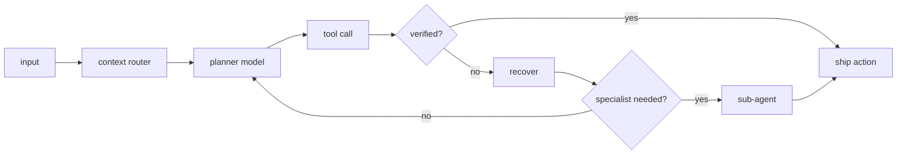

<!-- black-lab dossier: first screen -> proof -> work -> technical depth -> signals -->

<div align="center">

<br/>

<table>
<tr>
<td align="center" width="720">

<samp>LOCAL_INFERENCE / AGENT_HARNESS / FAILURE_RECOVERY</samp>

<h1>Anshul Panigrahi</h1>

<samp>AI/ML Engineer building edge AI systems and tool-using agents</samp>

<br/><br/>


<br/>

[](mailto:anshulpanigrahi3678@gmail.com)
[](https://linkedin.com/in/anshul-panigrahi22)
[](https://github.com/burntcookiedough)
[](Anshul_Panigrahi.pdf)

<br/>

<sub>AI/ML internships | agent systems | edge inference | 1 patents published</sub>

</td>
</tr>
</table>

</div>

---

> [!IMPORTANT]
> Actively looking for AI/ML internship roles where edge inference, tool-using agents, and industrial data matter more than demo-only chatbots.

<div align="center">

<table>
<tr>
<td align="center"><sub>patents</sub><br/><kbd>1 published</kbd></td>
<td align="center"><sub>scale</sub><br/><kbd>5,000 machines</kbd></td>
<td align="center"><sub>edge</sub><br/><kbd>&lt;100ms inference</kbd></td>
<td align="center"><sub>agents</sub><br/><kbd>recovery pipelines</kbd></td>
</tr>
</table>

</div>

```toml
[profile]
name = "Anshul Panigrahi"
role = "AI/ML Engineering Intern"
location = "VIT Vellore, Tamil Nadu, India"
current_build = "Hermes Agent + custom tool harness"

[operating_rules]
cloud = "optional"
failure = "recover, verify, hand off"
target = "edge AI, industrial ML, embedded inference"
```

---

## Repository Map

<div align="center">

| Track | Repositories |
|:---:|:---|
| **Flagship AI/ML** | Predictive Maintenance `(private/on request)` · [Mode Discovery](https://github.com/burntcookiedough/Physical-Bounded-Multimodal-Mode-Discovery) · [Stella](https://github.com/burntcookiedough/Stella) · [Veri-Dose](https://github.com/burntcookiedough/Veridose) |
| **Agents + Systems** | [Cognitive Load Scheduler](https://github.com/burntcookiedough/Cognitive-Load-Aware-Distributed-Task-Scheduler) · [Aether Dashboard](https://github.com/burntcookiedough/aether-dashboard) |
| **Edge + IoT** | [Vision Air Sim](https://github.com/burntcookiedough/vision-augmented-air-sim) · [Air Safety Assistant](https://github.com/burntcookiedough/Edge-Deployed-Air-Safety-Assistant) · [Smart Energy](https://github.com/burntcookiedough/Smart-Energy-Monitoring-System) |
| **Vision + Security** | [Face Privacy Filter](https://github.com/burntcookiedough/Face-Privacy-Filter) · [Sobel CUDA](https://github.com/burntcookiedough/Sobel-Edge-Detection) · [QR Security](https://github.com/burntcookiedough/QR-Code-Security-System) · [SecureTorrent](https://github.com/burntcookiedough/SecureTorrent) |

</div>

---

## Case Files

<table>
<tr>
<td width="50%" valign="top">

**Real-Time Predictive Maintenance**<br/>
<sub>Patent application filed | Feb 2026</sub>

Kafka, Spark, Cassandra, PyTorch, and graph analytics across 5,000 simulated factory machines to predict cascade failures before downtime.

`98% accuracy` `F1 0.96` `AUC 0.99` `<12ms latency`

Repository available on request.

</td>
<td width="50%" valign="top">

**Physical-Bounded Multimodal Mode Discovery**

Unsupervised fault discovery on NASA CMAPSS and CWRU. HDBSCAN proposes regimes; physics constraints reject invalid vibration and thermodynamic behavior.

`zero labels` `7 CMAPSS regimes` `8 CWRU regimes`

[Repository](https://github.com/burntcookiedough/Physical-Bounded-Multimodal-Mode-Discovery)

</td>
</tr>
<tr>
<td width="50%" valign="top">

**Stella**

On-device health assistant with Mistral 7B via Ollama. Wearable anomalies become local context, keeping personal health queries off the cloud.

`29 metrics` `33 users` `100% local` `0 cloud calls`

[Repository](https://github.com/burntcookiedough/Stella)

</td>
<td width="50%" valign="top">

**Veri-Dose**<br/>
<sub>Patent published | Mar 2026 | IN202641027860 A1</sub>

Smart medication dispenser using quantized MobileNetV2 on Raspberry Pi 4. Low-confidence predictions route to a human fallback.

`<100ms inference` `offline` `Raspberry Pi 4`

[Repository](https://github.com/burntcookiedough/Veridose)

</td>
</tr>
</table>

---

## Agent Harness

I am not building chatbots. I am building systems where models plan, call tools, recover from failure, and hand off when another model or tool is a better fit.

<details>
<summary><b>open agent harness</b></summary>

The model is not the product. The harness is: context routing, tool contracts, verification, recovery policy, and handoff logic.



Current stack: N8N, Claude Code, OpenAI Codex, Cursor Agent SDK, OpenClaw, Hermes, and custom tool pipelines when frameworks get in the way.

</details>

---

## Stack

<div align="center">


<br/>


</div>

---

## GitHub Signals

<div align="center">


<br/><br/>


</div>

---

## Contribution Snake

<picture>
  <source media="(prefers-color-scheme: dark)" srcset="https://raw.githubusercontent.com/burntcookiedough/burntcookiedough/output/github-snake-dark.svg"/>
  <source media="(prefers-color-scheme: light)" srcset="https://raw.githubusercontent.com/burntcookiedough/burntcookiedough/output/github-snake.svg"/>
  
</picture>

---

## Certifications

<div align="center">

<table>
<tr>
<th align="center">Certification</th>
<th align="center">Issuer</th>
<th align="center">Date</th>
</tr>
<tr>
<td align="center">Getting Started with Deep Learning</td>
<td align="center">NVIDIA DLI</td>
<td align="center">Mar 2026</td>
</tr>
<tr>
<td align="center">OCI 2025 AI Foundations Associate</td>
<td align="center">Oracle</td>
<td align="center">Mar 2026</td>
</tr>
<tr>
<td align="center">Software Engineer Intern Certificate</td>
<td align="center">HackerRank</td>
<td align="center">Feb 2026</td>
</tr>
<tr>
<td align="center">Intro to Machine Learning</td>
<td align="center">Kaggle</td>
<td align="center">Feb 2026</td>
</tr>
</table>

</div>

---

## Competitions

<div align="center">

[](https://github.com/burntcookiedough)
[](https://github.com/burntcookiedough)

</div>

---

<div align="center">

<samp>If your model needs the cloud to run, we have different philosophies.</samp>

<br/>

<samp>If your agent cannot recover from a bad tool call, it is not an agent. It is a very slow API.</samp>

<br/><br/>

[](https://github.com/burntcookiedough)

</div>
